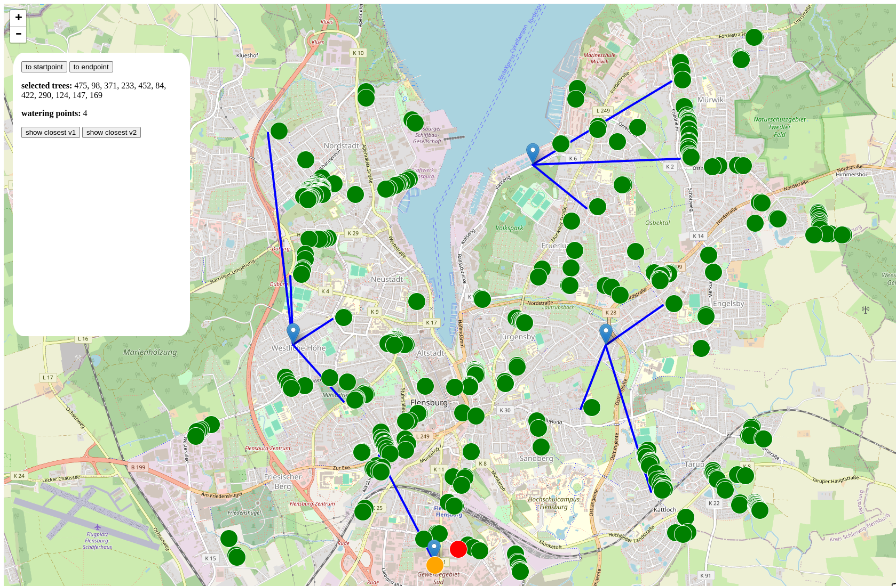

# POC vroom with two watering points

Für das Projekt [Green Ecolution](https://green-ecolution.de) wird [vroom](http://vroom-project.org/) eingesetzt, um die Einsatzplanung für die Bewässerung von Bäumen zu optimieren. Es wird evaluiert, wie vroom so eingesetzt werden kann, dass die Wassermengen bzw. die Verteilung der Wassermengen auf mehrere Wasserauffüllstationen realisiert werden kann. 

Dieser POC implementiert in erster Linie einen Ansatz, wie die Einsatzplanung mit mehreren Wasserauffüllstationen umgesetzt werden kann.



## Dependencies
Es wird zusätzlich eine [vroom](http://vroom-project.org/), sowie eine [valhalla](https://valhalla.github.io/valhalla/) instanz benötigt.

## How to start
```bash
go run .
```

## Aktueller Stand
1. Beurteilung, wie der nächstgelegene Punkt (verkehrsgünstig, nicht luftlinienseitig) zu einer Wasserentnahmestelle sinnvoll bestimmt werden kann

## Bedenken
1. Wie kann berechnet werden, dass eine Wasserauffüllstation angefahren werden soll (wann muss **nicht** zur Station B gefahren werden, wenn Station A zwar weiter weg ist aber besser in die Route passt)
2. Wie kann berechnet werden, dass eine Station angefahren werden muss, wenn dies nicht notwendig ist?

